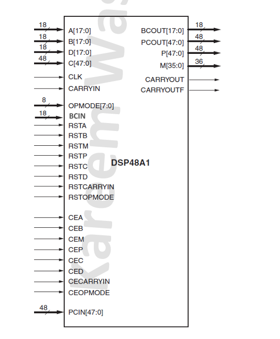
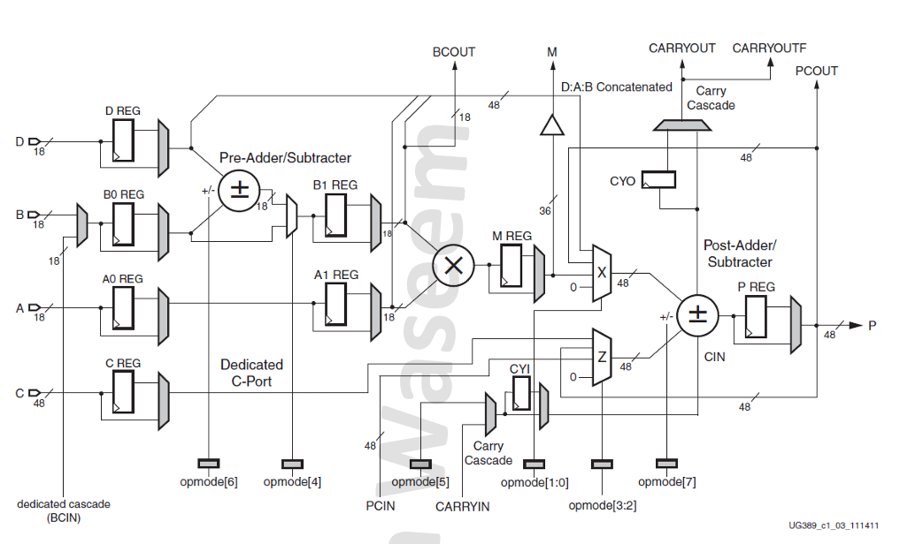

# DSP48A1 Verilog Implementation

A complete Verilog implementation of the Xilinx DSP48A1 slice, a high-performance digital signal processing block commonly found in Xilinx FPGAs.

## 📋 Table of Contents

- [Overview](#overview)
- [Features](#features)
- [Architecture](#architecture)
- [Component Black Box](#component-black-box)
- [Block Diagram](#block-diagram)
- [Parameters](#parameters)
- [Port Description](#port-description)
- [OPMODE Control](#opmode-control)
- [File Structure](#file-structure)
- [Getting Started](#getting-started)
- [Testbench](#testbench)
- [Simulation](#simulation)
- [Usage Examples](#usage-examples)
- [Contributing](#contributing)
- [License](#license)

## 🔍 Overview

The DSP48A1 is a dedicated digital signal processing slice that provides high-performance arithmetic operations including:
- 18×18 bit multiplication
- 48-bit addition/subtraction with optional pre-adder
- Configurable pipeline registers
- Cascade connectivity for building larger arithmetic functions

This implementation is fully parameterizable and supports both synchronous and asynchronous reset modes.

## ✨ Features

- **Full DSP48A1 Compatibility**: Implements all features of the Xilinx DSP48A1 primitive
- **Configurable Pipeline**: Optional registers at each pipeline stage
- **Pre-adder Support**: 18-bit pre-adder for efficient multiply-accumulate operations
- **48-bit Post-adder**: Wide arithmetic with carry chain support
- **Cascade Connectivity**: BCIN/BCOUT and PCIN/PCOUT for chaining multiple DSP slices
- **Flexible Reset**: Support for both synchronous and asynchronous reset
- **OPMODE Control**: 8-bit operation mode for flexible arithmetic configurations

## 🏗️ Architecture

The DSP48A1 consists of the following main functional blocks:

1. **Input Pipeline Registers** (A0/A1, B0/B1, C, D)
2. **Pre-adder** (18-bit: D ± B)
3. **Multiplier** (18×18 → 36-bit)
4. **Post-adder** (48-bit with carry)
5. **Output Registers** (M, P)
6. **Control Logic** (OPMODE, Carry-in selection)

## 📦 Component Black Box



*DSP48A1 component showing all input and output ports with their bit widths*

### Port Summary:
- **Data Inputs**: A[17:0], B[17:0], C[47:0], D[17:0], BCIN[17:0], PCIN[47:0], CARRYIN
- **Control Inputs**: OPMODE[7:0], CLK, CE*, RST*
- **Data Outputs**: M[35:0], P[47:0], BCOUT[17:0], PCOUT[47:0], CARRYOUT, CARRYOUTF

## 📊 Block Diagram



*Detailed internal architecture showing pipeline registers, multiplexers, pre-adder, multiplier, post-adder, and control logic*

### Key Components:
1. **Input Pipeline**: A0/A1, B0/B1, C, D registers
2. **Pre-adder**: 18-bit D±B operation
3. **Multiplier**: 18×18 → 36-bit multiplication
4. **Post-adder**: 48-bit Z±X operation with carry
5. **Output Pipeline**: M and P registers
6. **Control Logic**: OPMODE and carry-in selection

### Data Flow:
- **A Path**: A → A0 → A1 → Multiplier
- **B Path**: B → B0 → (Pre-adder) → B1 → Multiplier  
- **C Path**: C → C_reg → Z_mux → Post-adder
- **D Path**: D → D_reg → Pre-adder
- **Output**: Multiplier → M_reg, Post-adder → P_reg

## ⚙️ Parameters

| Parameter | Default | Description |
|-----------|---------|-------------|
| `A0REG` | 0 | First pipeline register for A input |
| `A1REG` | 1 | Second pipeline register for A input |
| `B0REG` | 0 | First pipeline register for B input |
| `B1REG` | 1 | Second pipeline register for B input |
| `CREG` | 1 | Register for C input |
| `DREG` | 1 | Register for D input |
| `MREG` | 1 | Register for multiplier output |
| `PREG` | 1 | Register for P output |
| `OPMODEREG` | 1 | Register for OPMODE control |
| `CARRYINREG` | 1 | Register for carry-in |
| `CARRYOUTREG` | 1 | Register for carry-out |
| `CARRYINSEL` | "OPMODE5" | Carry input selection ("CARRYIN" or "OPMODE5") |
| `B_INPUT` | "DIRECT" | B input source ("DIRECT" or "CASCADE") |
| `RSTTYPE` | "SYNC" | Reset type ("SYNC" or "ASYNC") |

## 🔌 Port Description

### Data Inputs
- **A[17:0]**: 18-bit multiplier input
- **B[17:0]**: 18-bit multiplier/pre-adder input
- **C[47:0]**: 48-bit post-adder input
- **D[17:0]**: 18-bit pre-adder input
- **BCIN[17:0]**: 18-bit cascade input for B
- **PCIN[47:0]**: 48-bit cascade input for P
- **CARRYIN**: Carry input for post-adder

### Control Inputs
- **OPMODE[7:0]**: Operation mode control
- **CLK**: Clock signal
- **CE***: Clock enable signals for each pipeline stage
- **RST***: Reset signals for each pipeline stage

### Outputs
- **M[35:0]**: 36-bit multiplier output
- **P[47:0]**: 48-bit main output
- **BCOUT[17:0]**: 18-bit cascade output for B
- **PCOUT[47:0]**: 48-bit cascade output for P
- **CARRYOUT**: Registered carry output
- **CARRYOUTF**: Direct carry output to fabric

## 🎛️ OPMODE Control

The 8-bit OPMODE signal controls the operation of the DSP slice:

| Bit | Function |
|-----|----------|
| OPMODE[1:0] | X multiplexer control (00: Zero, 01: M, 10: P, 11: D:A:B) |
| OPMODE[3:2] | Z multiplexer control (00: Zero, 01: PCIN, 10: P, 11: C) |
| OPMODE[4] | Pre-adder enable (0: B to multiplier, 1: D±B to multiplier) |
| OPMODE[5] | Carry-in source when CARRYINSEL="OPMODE5" |
| OPMODE[6] | Pre-adder operation (0: D+B, 1: D-B) |
| OPMODE[7] | Post-adder operation (0: Z+X, 1: Z-X) |

## 📁 File Structure

```
DSP48A1/
├── README.md                    # This file
├── black_box.png               # Component black box diagram
├── schematic.png               # Internal architecture diagram
├── DSP48A1_Architecture_Notes.md  # Detailed architecture documentation
├── Desgin/                     # Main design files
│   ├── DSP48A1.v              # Main DSP48A1 module
│   ├── mux2x1.v               # 2:1 multiplexer
│   ├── mux4x1.v               # 4:1 multiplexer
│   ├── pipe_stage.v           # Configurable pipeline register
│   ├── preadder.v             # 18-bit pre-adder
│   ├── postadder.v            # 48-bit post-adder
│   └── Constraints_DSP48A1.xdc # Xilinx constraints file
├── Testbench/                  # Verification files
│   ├── DSP48A1_tb.v           # Self-checking testbench
│   └── sim.do                 # ModelSim simulation script
├── Snippets/                   # Documentation images
│   ├── simulation results/     # Simulation screenshots
│   ├── timing diagrams/        # Timing analysis images
│   └── schematic views/        # Additional schematic views
└── docs/                       # Additional documentation
    └── specifications/         # Reference documents
```

## 🚀 Getting Started

### Prerequisites
- Verilog simulator (ModelSim, Vivado, Icarus Verilog, etc.)
- Basic understanding of digital signal processing concepts

### Quick Start

1. **Clone the repository**:
   ```bash
   git clone https://github.com/mo7amedmengasu/DSP48A1.git
   cd DSP48A1
   ```

2. **Compile the design**:
   ```bash
   # Using Icarus Verilog
   iverilog -o dsp48a1_sim Desgin/*.v Testbench/DSP48A1_tb.v
   
   # Using ModelSim (use the provided sim.do script)
   cd Testbench
   vsim -do sim.do
   ```

3. **Run the testbench**:
   ```bash
   # Using Icarus Verilog
   vvp dsp48a1_sim
   
   # Using ModelSim
   # The sim.do script will automatically run the simulation
   ```

## 🧪 Testbench

The included testbench (`Testbench/DSP48A1_tb.v`) provides comprehensive verification of the DSP48A1 functionality:

### Test Cases:
1. **Reset Operation**: Verifies all outputs are zero during reset
2. **DSP Path 1**: Pre-subtractor + Post-subtractor (OPMODE = 8'b11011101)
3. **DSP Path 2**: Pre-addition + zeros (OPMODE = 8'b00010000)
4. **DSP Path 3**: No pre-adder + P feedback (OPMODE = 8'b00001010)
5. **DSP Path 4**: D:A:B concatenation + PCIN (OPMODE = 8'b10100111)

### Simulation Results:
The `Snippets/` folder contains detailed simulation results including:
- Timing diagrams
- Simulation screenshots  
- Schematic views
- Error/success messages

### Expected Results:
The testbench includes self-checking functionality with expected values for each test case.

## 📈 Simulation

### Timing Considerations:
- Pipeline depth varies based on register configuration
- Typical latency: 1-4 clock cycles depending on enabled registers
- Maximum frequency depends on target technology and synthesis settings

### Performance Metrics:
- **Multiplier**: 18×18 → 36-bit in 1 clock cycle
- **Pre-adder**: 18-bit addition/subtraction
- **Post-adder**: 48-bit addition/subtraction with carry

## 💡 Usage Examples

### Example 1: Simple Multiplication
```verilog
DSP48A1 #(
    .A1REG(1), .B1REG(1), .MREG(1), .PREG(1)
) dsp_mult (
    .A(a_input), .B(b_input),
    .OPMODE(8'b00000001), // Route M to output
    .CLK(clk), .CEA(1'b1), .CEB(1'b1), .CEM(1'b1), .CEP(1'b1),
    .M(mult_result)
);
```

### Example 2: Multiply-Accumulate
```verilog
DSP48A1 #(
    .A1REG(1), .B1REG(1), .MREG(1), .PREG(1)
) dsp_mac (
    .A(a_input), .B(b_input),
    .OPMODE(8'b00100001), // M + P (accumulate)
    .CLK(clk), .CEA(1'b1), .CEB(1'b1), .CEM(1'b1), .CEP(1'b1),
    .P(mac_result)
);
```

## 🤝 Contributing

Contributions are welcome! Please feel free to submit pull requests or open issues for:
- Bug fixes
- Performance improvements
- Documentation enhancements
- Additional test cases

### Guidelines:
1. Follow Verilog coding standards
2. Include appropriate comments
3. Add test cases for new features
4. Update documentation as needed

## 📄 License

This project is licensed under the MIT License - see the [LICENSE](LICENSE) file for details.

## 📞 Contact

- **Author**: Mohamed Mengasu
- **GitHub**: [@mo7amedmengasu](https://github.com/mo7amedmengasu)
- **Project Repository**: [DSP48A1](https://github.com/mo7amedmengasu/DSP48A1)

---

**Note**: This implementation is for educational and research purposes. For production use in Xilinx FPGAs, use the official DSP48A1 primitive.
